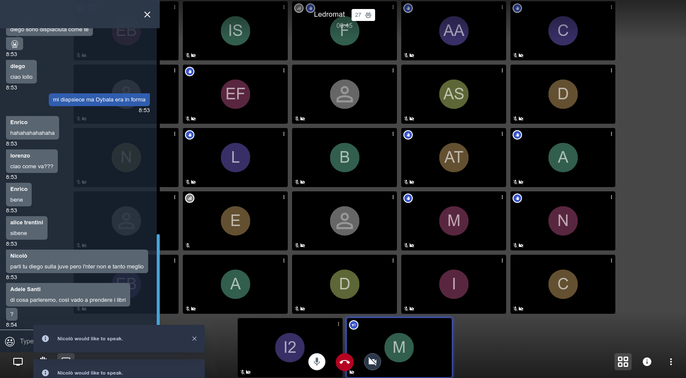

<!--
N.B.: This README was automatically generated by <https://github.com/YunoHost/apps/tree/master/tools/readme_generator>
It shall NOT be edited by hand.
-->

# Jitsi Meet for YunoHost

[](https://dash.yunohost.org/appci/app/jitsi)  

[](https://install-app.yunohost.org/?app=jitsi)

*[Read this README in other languages.](./ALL_README.md)*

> *This package allows you to install Jitsi Meet quickly and simply on a YunoHost server.*  
> *If you don't have YunoHost, please consult [the guide](https://yunohost.org/install) to learn how to install it.*

## Overview

Jitsi Meet is a libre software (Apache) WebRTC JavaScript app that uses Jitsi Videobridge to provide high quality, secure, and scalable video conferences.


**Shipped version:** 2.0.9646~ynh1

**Demo:** <https://meet.jit.si/>

## Screenshots



## Documentation and resources

- Official app website: <https://jitsi.org/>
- Official user documentation: <https://jitsi.org/user-faq/>
- Upstream app code repository: <https://github.com/jitsi/jitsi-meet>
- YunoHost Store: <https://apps.yunohost.org/app/jitsi>
- Report a bug: <https://github.com/YunoHost-Apps/jitsi_ynh/issues>

## Developer info

Please send your pull request to the [`testing` branch](https://github.com/YunoHost-Apps/jitsi_ynh/tree/testing).

To try the `testing` branch, please proceed like that:

```bash
sudo yunohost app install https://github.com/YunoHost-Apps/jitsi_ynh/tree/testing --debug
or
sudo yunohost app upgrade jitsi -u https://github.com/YunoHost-Apps/jitsi_ynh/tree/testing --debug
```

**More info regarding app packaging:** <https://yunohost.org/packaging_apps>
